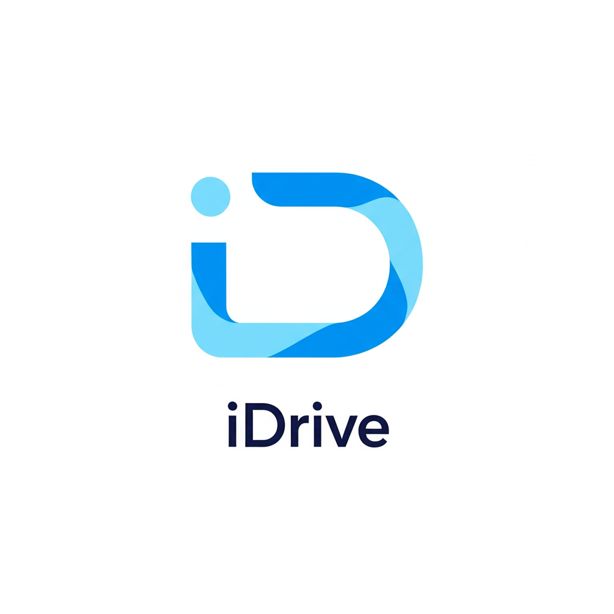

<a name="readme-top"></a>

<div align="center">
  
  <br/>
  <h3><b>IDRIVE - Sistema de Gestión de Usuarios</b></h3>
</div>
---

# 📗 Tabla de Contenidos

- [📖 Acerca del Proyecto](#acerca-del-proyecto)
  - [🛠 Tecnologías Utilizadas](#tecnologias-utilizadas)
    - [🔧 Stack Tecnológico](#stack-tecnologico)
    - [✨ Características Clave](#caracteristicas-clave)
  - [🚀 Demo en Vivo](#demo-en-vivo)
- [💻 Cómo Empezar](#como-empezar)
  - [⚙️ Requisitos Previos](#requisitos-previos)
  - [📦 Instalación](#instalacion)
  - [🐳 Despliegue con Docker](#despliegue-con-docker)
  - [🚀 Uso](#uso)
  - [🧪 Pruebas](#pruebas)
  - [🚢 Despliegue](#despliegue)
- [👥 Autores](#autores)
- [🔭 Futuras Características](#futuras-caracteristicas)
- [🤝 Contribuciones](#contribuciones)
- [⭐️ Apoya el Proyecto](#apoyo)
- [🙏 Agradecimientos](#agradecimientos)
- [📝 Licencia](#licencia)

---

# 📖 Acerca del Proyecto <a name="acerca-del-proyecto"></a>

**IDRIVE** es una aplicación web desarrollada para que las escuelas de conducción y sus estudiantes puedan gestionar sus clases de manera eficiente. Utiliza FastAPI para el backend y React para el frontend, ofreciendo funcionalidades completas como:

* Creación, edición, eliminación y búsqueda de usuarios.
* Validación de datos y control de roles para garantizar una gestión segura.
* Cifrado de contraseñas para proteger la información de los usuarios.
* Creación y programación de clases teóricas, tanto para estudiantes como para administradores de academias.

iDrive está diseñada para optimizar los procesos administrativos y mejorar la experiencia de estudiantes y personal de las escuelas de conducción.

---

## 🛠 Tecnologías Utilizadas <a name="tecnologias-utilizadas"></a>

### 🔧 Stack Tecnológico <a name="stack-tecnologico"></a>

**Backend**
- FastAPI
- MySQL
- Bcrypt

**Frontend**
- React.js
- Bootstrap
- React Bootstrap
- Axios
- React icons
- React Router DOM
- React Toastify
- FontAwesome
- FullCalendar

---

### ✨ Características Clave <a name="caracteristicas-clave"></a>

- 📋 CRUD de usuarios con nombre, correo, cédula y rol
- 🔒 Encriptación de contraseñas con Bcrypt
- 🔎 Búsqueda en tiempo real
- 🧠 Validación de datos y manejo de errores
- 📅 Calendario interactivo con FullCalendar
- 🌐 Comunicación API REST entre frontend y backend

<p align="right">[volver al inicio](#readme-top)</p>

---

## 🚀 Demo en Vivo <a name="demo-en-vivo"></a>

> Próximamente

<p align="right">[volver al inicio](#readme-top)</p>

---

## 💻 Cómo Empezar <a name="como-empezar"></a>

### ⚙️ Requisitos Previos <a name="requisitos-previos"></a>

Asegúrate de tener instalado lo siguiente:

- Python 3.10+
- Node.js
- MySQL
- Git
- Docker y Docker Compose (para despliegue con contenedores)

---

### 📦 Instalación <a name="instalacion"></a>

#### Backend

```bash
cd backend
python -m venv venv
source venv/bin/activate  # En Windows: venv\Scripts\activate
pip install -r requirements.txt
uvicorn main:app --reload
```

#### Frontend

```bash
cd frontend
npm install
npm start
```

### 🐳 Despliegue con Docker

También puedes levantar todo el entorno de desarrollo (backend, frontend y base de datos) usando Docker Compose. Este es el método recomendado.

#### Clonar el repositorio

```bash
git clone https://github.com/BryanMBS/IDRIVE.git
cd IDRIVE
```

#### Crear archivo de variables de entorno

En la raíz del proyecto, crea un archivo llamado `.env`. Este archivo contendrá las credenciales y configuraciones para que los contenedores funcionen.

```env
# Credenciales para la Base de Datos
DB_DATABASE=DataBaseiDrive
DB_USER=root
DB_PASSWORD=rootpassword
DB_ROOT_PASSWORD=supersecretpassword

# Puertos de la aplicación
FRONTEND_PORT=3000
BACKEND_PORT=8000
DB_PORT=3307
```

#### Levantar los servicios

```bash
docker-compose up -d --build
```

Una vez finalizado, la aplicación estará disponible en:

- Frontend: http://localhost:3000
- Backend (API Docs): http://localhost:8000/docs

---

### 🚀 Uso

- Asegúrate de que tu base de datos esté activa (si no usas Docker).
- Inicia el backend con `uvicorn`.
- Abre otra terminal e inicia el frontend con `npm start`.

---

### 🧪 Pruebas

Las pruebas automatizadas se implementarán en futuras versiones. Actualmente, puedes probar el funcionamiento de forma manual desde la interfaz web.

---

### 🚢 Despliegue

Este proyecto puede desplegarse en servicios como Azure, Render, o Vercel para el frontend, o utilizando Docker en cualquier proveedor de nube.

<p align="right">[volver al inicio](#readme-top)</p>

---

## 👥 Autores

👤 Bryan Mora

GitHub: [@BryanMBS](https://github.com/BryanMBS)

<p align="right">[volver al inicio](#readme-top)</p>

---

## 🔭 Futuras Características

- [ ] Panel de administración con estadísticas
- [ ] Soporte multilenguaje

<p align="right">[volver al inicio](#readme-top)</p>

---

## 🤝 Contribuciones

¡Las contribuciones, issues y solicitudes de mejoras son bienvenidas!

Siente la libertad de revisar la página de issues.

<p align="right">[volver al inicio](#readme-top)</p>

---

## ⭐️ Apoya el Proyecto

Si te gusta este proyecto, dale una estrella ⭐ en GitHub para apoyar su desarrollo.

<p align="right">[volver al inicio](#readme-top)</p>

---

## 📝 Licencia

Este proyecto está licenciado bajo la licencia MIT. Consulta el archivo LICENSE.md para más información.

<p align="right">[volver al inicio](#readme-top)</p>
